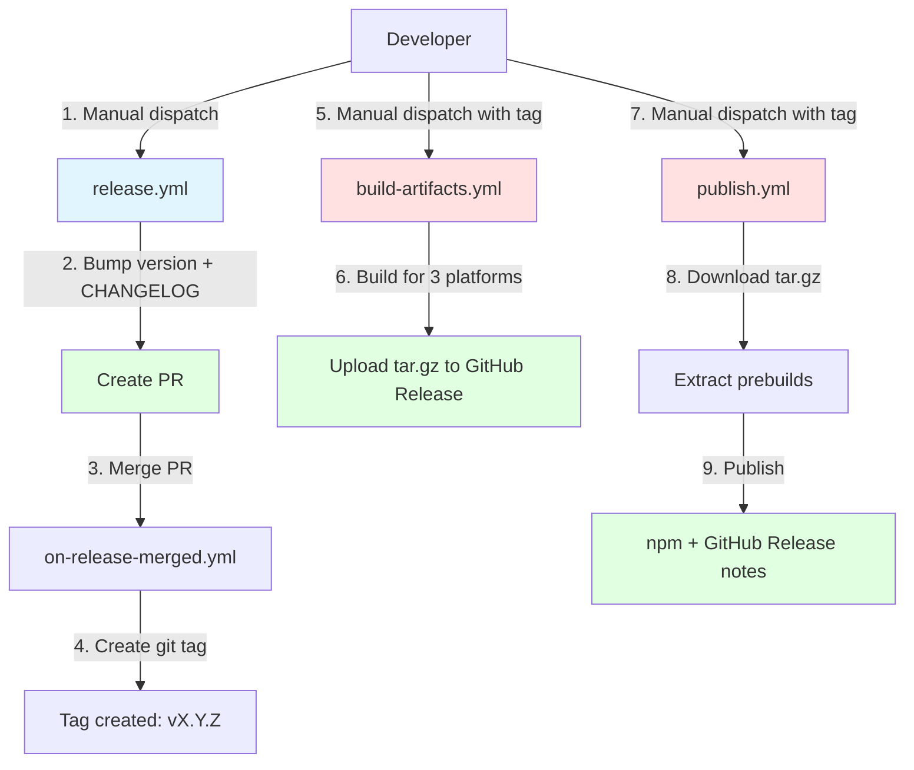
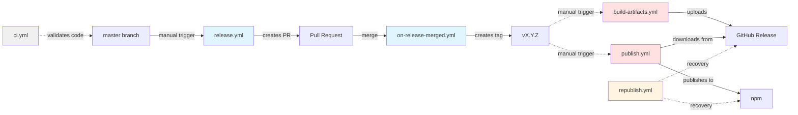
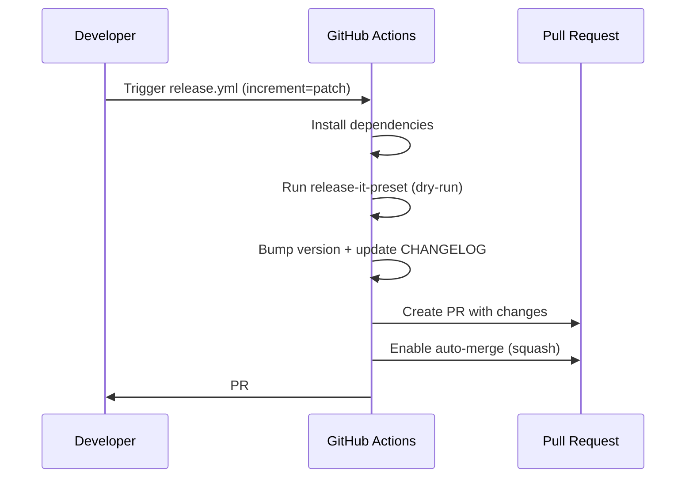
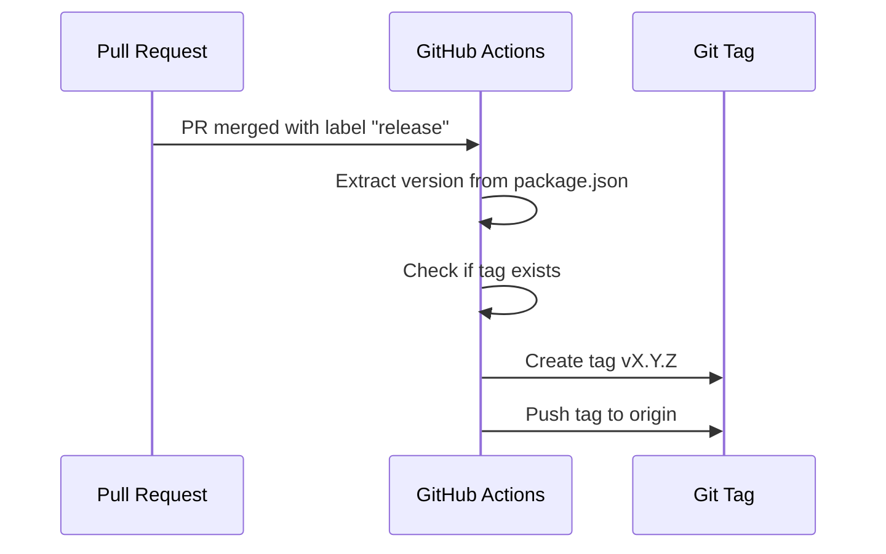
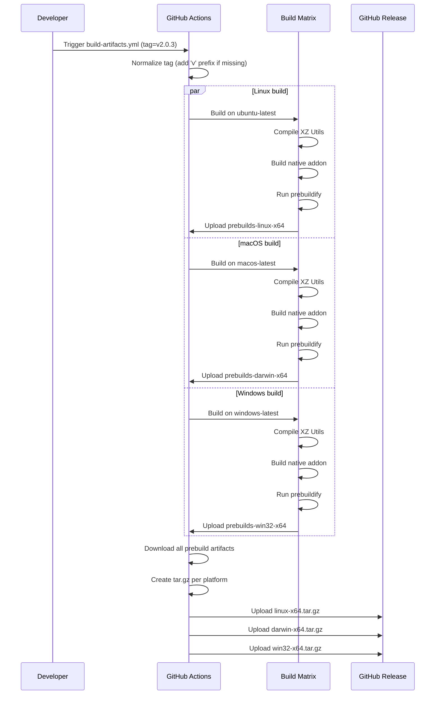
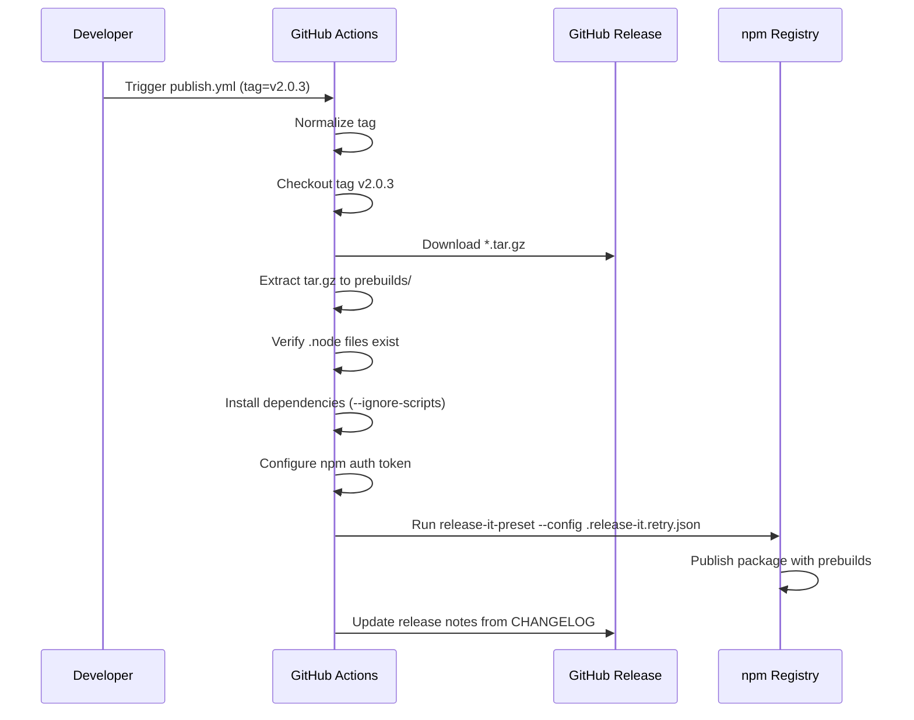
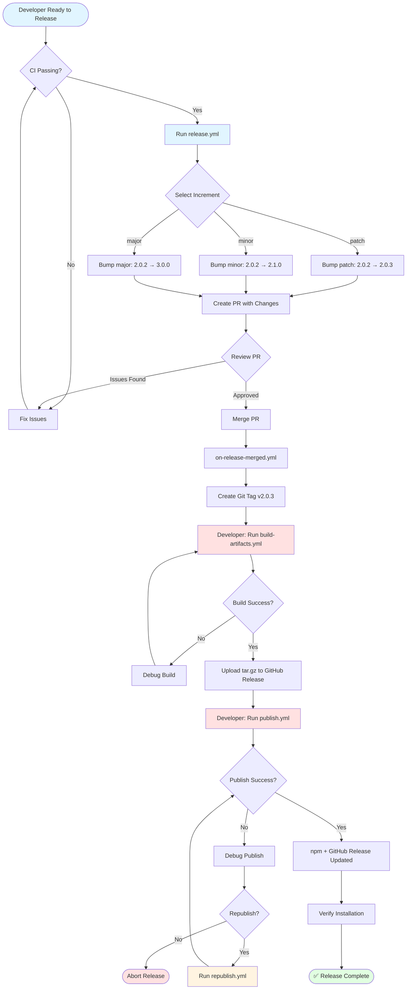

# Release Process for node-liblzma

This document describes the complete release process for node-liblzma, a Node.js native addon with prebuilt binaries for multiple platforms.

## Table of Contents

- [Overview](#overview)
- [Architecture](#architecture)
- [Workflows](#workflows)
- [Release Guide](#release-guide)
- [Use Cases](#use-cases)
- [Troubleshooting](#troubleshooting)
- [Design Decisions](#design-decisions)

## Overview

node-liblzma uses a **semi-automated release process** that combines:
- ✅ Automated version bumping and CHANGELOG generation via `@oorabona/release-it-preset`
- ✅ Pull Request-based workflow for branch protection compatibility (GPG signatures)
- ⚠️ Manual steps for building and publishing native prebuilds
- ✅ Distribution via tar.gz archives on GitHub Releases

**Key characteristics:**
- Native C++ addon requiring prebuilds for linux/darwin/win32
- XZ Utils dependency managed via CMake
- Prebuilds distributed as tar.gz archives (one per platform)
- npm package downloads correct prebuild at install time via `node-gyp-build`

## Architecture

### Current Workflow Architecture



### Workflow Dependencies



## Workflows

### 1. `ci.yml` - Continuous Integration

**Trigger:** `push`, `pull_request`, `schedule`, `workflow_dispatch`

**Purpose:** Validate code quality and run tests before any release.

**Jobs:**
- `setup` - Detects whether to run smoke or full tests
- `download-xz` - Downloads XZ Utils sources (shared across matrix)
- `quality` - Linting, formatting, type checking
- `smoke-test` - Fast validation (1 OS/Node combo per platform)
- `full-test` - Comprehensive matrix (multiple configs)
- `threading-test` - Multi-threading support validation
- `summary` - Overall CI status

**Key Features:**
- ✅ Smart detection: smoke tests for PRs, full tests for pushes/schedule
- ✅ Retry mechanism (5 attempts) for flaky tests
- ✅ XZ caching to speed up builds
- ✅ ccache support for C++ compilation
- ❌ Does NOT build prebuilds (only validates source)

**Path filters:** Ignores docs, README, and non-critical files.

---

### 2. `release.yml` - Create Release PR

**Trigger:** `workflow_dispatch` (manual)

**Purpose:** Create a Pull Request with version bump and CHANGELOG update.

**Inputs:**
- `increment` - Version increment type: `patch`, `minor`, or `major`

**Flow:**



**What it does:**
1. ✅ Runs `pnpm release-it-preset default --no-git.push --ci --increment <type>`
2. ✅ Bumps version in `package.json`
3. ✅ Updates CHANGELOG.md (moves [Unreleased] to [vX.Y.Z])
4. ✅ Creates Pull Request with changes
5. ✅ Enables auto-merge (squash)

**What it does NOT do:**
- ❌ Does NOT create git tag (done by on-release-merged.yml)
- ❌ Does NOT build prebuilds
- ❌ Does NOT publish anything

**Branch protection:** Works with GPG signature requirements because changes are in a PR.

---

### 3. `on-release-merged.yml` - Tag Creation

**Trigger:** `pull_request` (type: `closed`)

**Purpose:** Automatically create git tag after release PR is merged.

**Conditions:**
- ✅ PR must be merged (not just closed)
- ✅ PR must have label `release`
- ✅ PR must be created by `github-actions[bot]` (security)

**Flow:**



**What it does:**
1. ✅ Reads version from `package.json`
2. ✅ Creates annotated git tag `v<version>`
3. ✅ Pushes tag to origin

**What it does NOT do:**
- ❌ Does NOT trigger build-artifacts.yml automatically
- ❌ Does NOT trigger publish.yml automatically

**Note:** After tag creation, you must manually trigger `build-artifacts.yml` and `publish.yml`.

---

### 4. `build-artifacts.yml` - Build Native Prebuilds

**Trigger:** `workflow_call`, `workflow_dispatch` (manual)

**Purpose:** Build native C++ addon for all platforms and upload to GitHub Release.

**Inputs:**
- `tag` - Git tag for GitHub Release upload (e.g., `v2.0.3`)

**Matrix:**
- OS: `ubuntu-latest`, `macos-latest`, `windows-latest`
- Node: 20 (prebuildify creates binaries for Node 16/18/20/22)
- Configuration: `RUNTIME_LINK=static`, `ENABLE_THREAD_SUPPORT=yes`

**Flow:**



**What it does:**
1. ✅ Checks out the specified tag
2. ✅ Builds XZ Utils from source using CMake
3. ✅ Compiles native addon for each platform
4. ✅ Runs `prebuildify` to create `.node` binaries
5. ✅ Creates tar.gz archives: `linux-x64.tar.gz`, `darwin-x64.tar.gz`, `win32-x64.tar.gz`
6. ✅ Uploads archives to GitHub Release

**Caching:**
- ✅ XZ sources cached per version
- ✅ ccache for C++ compilation
- ✅ pnpm store

**Build configuration:**
```bash
USE_GLOBAL=false           # Use bundled XZ, not system
RUNTIME_LINK=static        # Static linking (no dylib dependency)
ENABLE_THREAD_SUPPORT=yes  # Multi-threading enabled
```

**Output structure:**
```
GitHub Release v2.0.3/
├── linux-x64.tar.gz    → prebuilds/linux-x64/node.napi.node
├── darwin-x64.tar.gz   → prebuilds/darwin-x64/node.napi.node
└── win32-x64.tar.gz    → prebuilds/win32-x64/node.napi.node
```

---

### 5. `publish.yml` - Publish to npm

**Trigger:** `push` (tags: `v*`), `workflow_call`, `workflow_dispatch` (manual)

**Purpose:** Download prebuilds from GitHub Release and publish to npm.

**Inputs:**
- `tag` - Git tag to publish (e.g., `v2.0.3`)
- `skip_npm` - Skip npm publish (for testing)

**Flow:**



**What it does:**
1. ✅ Downloads tar.gz archives from GitHub Release
2. ✅ Extracts prebuilds to `prebuilds/` directory
3. ✅ Verifies `.node` files exist
4. ✅ Installs dependencies with `--ignore-scripts` (prevents rebuild)
5. ✅ Configures npm authentication
6. ✅ Runs `pnpm release-it-preset --config .release-it.retry.json --ci`
7. ✅ Publishes to npm with prebuilds included
8. ✅ Updates GitHub Release notes from CHANGELOG

**What it does NOT do:**
- ❌ Does NOT rebuild prebuilds (downloads from GitHub Release)
- ❌ Does NOT create git tag (already exists)
- ❌ Does NOT bump version (already done)

**Configuration:** Uses `.release-it.retry.json` which extends `@oorabona/release-it-preset/config/retry-publish`.

---

### 6. `republish.yml` - Manual Republication

**Trigger:** `workflow_dispatch` (manual)

**Purpose:** Republish an existing version (recovery mechanism).

**Inputs:**
- `version` - Version to republish (e.g., `2.0.1`)
- `target` - Publication target: `npm-only`, `github-only`, or `both`
- `confirmation` - Safety phrase: `I understand the risks`

**Use cases:**
- npm publish failed but GitHub Release succeeded → republish to npm only
- GitHub Release corrupted → republish to GitHub only
- Complete republication needed → republish to both

**Pre-flight checks:**
1. ✅ Confirmation phrase matches
2. ✅ Version is valid semver
3. ✅ Git tag exists remotely

---

## Release Guide

### Complete Release Process (Step-by-Step)

#### Prerequisites

- [ ] All PRs merged to `master`
- [ ] CI passing on `master` branch
- [ ] CHANGELOG.md has [Unreleased] section with changes
- [ ] You have write access to repository
- [ ] NPM_TOKEN secret configured

#### Step 1: Create Release PR

1. Go to **Actions** → **Release**
2. Click **Run workflow**
3. Select `master` branch
4. Choose increment type:
   - `patch` - Bug fixes (2.0.2 → 2.0.3)
   - `minor` - New features (2.0.2 → 2.1.0)
   - `major` - Breaking changes (2.0.2 → 3.0.0)
5. Click **Run workflow**

**Expected result:** PR created (e.g., #28) with version bump and CHANGELOG update.

#### Step 2: Review and Merge PR

1. Review the PR changes:
   - ✅ Version bumped in `package.json`
   - ✅ CHANGELOG.md updated correctly
   - ✅ All files look correct
2. Approve and merge the PR (or wait for auto-merge)

**Expected result:** Tag created automatically (e.g., `v2.0.3`)

#### Step 3: Build Prebuilds

1. Go to **Actions** → **Build Artifacts**
2. Click **Run workflow**
3. Enter tag: `v2.0.3` (or `2.0.3` without `v` prefix)
4. Click **Run workflow**
5. Wait for builds to complete (~10-15 minutes)

**Expected result:** Three tar.gz files uploaded to GitHub Release v2.0.3:
- `linux-x64.tar.gz`
- `darwin-x64.tar.gz`
- `win32-x64.tar.gz`

**Verify:**
```bash
gh release view v2.0.3
# Should show 3 tar.gz assets
```

#### Step 4: Publish to npm

1. Go to **Actions** → **Publish**
2. Click **Run workflow**
3. Enter tag: `v2.0.3`
4. Leave `skip_npm` unchecked
5. Click **Run workflow**
6. Wait for publish to complete (~2-3 minutes)

**Expected result:** Package published to npm with prebuilds included.

**Verify:**
```bash
npm view node-liblzma version
# Should show 2.0.3

gh release view v2.0.3
# Should show updated release notes from CHANGELOG
```

#### Step 5: Verify Installation

Test that users can install the package:

```bash
npm install node-liblzma@2.0.3
# Should download from npm and use prebuilt binary
```

---

## Use Cases

### Use Case 1: Patch Release (Bug Fix)

**Scenario:** Fix a critical bug and release v2.0.4

1. Fix bug in code, commit to `master`
2. Update CHANGELOG.md (add to [Unreleased])
3. Run `release.yml` with `increment=patch`
4. Merge PR
5. Run `build-artifacts.yml` with tag `v2.0.4`
6. Run `publish.yml` with tag `v2.0.4`

**Timeline:** ~20 minutes total

---

### Use Case 2: Minor Release (New Feature)

**Scenario:** Add new API and release v2.1.0

1. Develop feature in PR, get reviewed
2. Merge to `master`
3. Update CHANGELOG.md (add to [Unreleased])
4. Run `release.yml` with `increment=minor`
5. Merge PR
6. Run `build-artifacts.yml` with tag `v2.1.0`
7. Run `publish.yml` with tag `v2.1.0`

**Timeline:** ~20 minutes total

---

### Use Case 3: Republish After npm Failure

**Scenario:** npm publish failed, but GitHub Release succeeded

1. Go to **Actions** → **Republish**
2. Enter version: `2.0.3`
3. Select target: `npm-only`
4. Enter confirmation: `I understand the risks`
5. Run workflow

**Timeline:** ~5 minutes

---

### Use Case 4: Fix Corrupted Prebuilds

**Scenario:** Prebuilds on GitHub Release are corrupted

1. Delete corrupted assets from GitHub Release
2. Go to **Actions** → **Build Artifacts**
3. Enter tag: `v2.0.3`
4. Run workflow
5. Verify new tar.gz files uploaded

**Timeline:** ~15 minutes

---

## Troubleshooting

### Problem: "Channel closed" error in CI tests

**Symptoms:**
```
Error: channel closed
    at ChildProcess.target._send (node:internal/child_process:...)
```

**Solution:** Already fixed in `vitest.config.ts` using fork-based worker pool on macOS.

**Reference:** Vitest issue #8201

---

### Problem: build-artifacts.yml fails with "XZ not found"

**Symptoms:**
```
CMake Error: Could not find XZ sources
```

**Solution:**
1. Check XZ cache is working
2. Verify `scripts/download_xz_from_github.py` has GITHUB_TOKEN
3. Clear cache and re-run

---

### Problem: publish.yml fails with "No prebuilds found"

**Symptoms:**
```
❌ No prebuilds found after extraction
```

**Root cause:** `build-artifacts.yml` was not run before `publish.yml`

**Solution:**
1. Run `build-artifacts.yml` first with the tag
2. Verify tar.gz files uploaded to GitHub Release
3. Re-run `publish.yml`

---

### Problem: npm authentication error

**Symptoms:**
```
ERROR Not authenticated with npm
```

**Solution:**
1. Verify NPM_TOKEN secret exists in repository settings
2. Check token has publish permissions
3. Token must be automation token (not classic)

---

### Problem: Tag already exists

**Symptoms:**
```
fatal: tag 'v2.0.3' already exists
```

**Solution:**

**Option A:** Delete tag and re-release
```bash
git tag -d v2.0.3
git push origin :refs/tags/v2.0.3
```

**Option B:** Increment to next version (recommended)
- Use `release.yml` with `increment=patch` to create v2.0.4

---

### Problem: Prebuilds overwriting each other

**Symptoms:** Only 1 `.node` file uploaded instead of 3

**Root cause:** This was a bug in early versions, fixed in v2.0.2+

**Solution:** Already fixed by using tar.gz archives with unique names:
- `linux-x64.tar.gz`
- `darwin-x64.tar.gz`
- `win32-x64.tar.gz`

**Verification:**
```bash
gh release view v2.0.3 --json assets -q '.assets[].name'
```

Should show all 3 tar.gz files.

---

## Design Decisions

### Why Semi-Automated (Not Fully Automated)?

**Decision:** Manual triggers for `build-artifacts.yml` and `publish.yml`

**Rationale:**
1. ✅ **Safety:** Allows human verification between steps
2. ✅ **Debugging:** Easier to debug failures in isolation
3. ✅ **Flexibility:** Can rebuild without republishing
4. ✅ **Cost:** Avoid unnecessary GitHub Actions minutes

**Trade-off:** Requires 3 manual steps instead of 1, but provides better control.

---

### Why PR-Based Release Workflow?

**Decision:** `release.yml` creates PR instead of directly pushing tag

**Rationale:**
1. ✅ **Branch Protection:** Compatible with GPG signature requirements
2. ✅ **Review:** Team can review version bump and CHANGELOG
3. ✅ **CI Validation:** CI runs on PR before release
4. ✅ **Rollback:** Easy to close PR if issues found

**Alternative:** Direct tag push requires bypassing branch protection.

---

### Why Separate .release-it.retry.json?

**Decision:** Two separate config files instead of one

**Files:**
- `.release-it.json` - Extends `default` preset (for release.yml)
- `.release-it.retry.json` - Extends `retry-publish` preset (for publish.yml)

**Rationale:**
1. ✅ **Validation:** `release-it-preset` validates CLI matches config file
2. ✅ **Clarity:** Clear separation between "create release" and "publish release"
3. ✅ **DRY:** Both files extend presets (no duplication)

**Alternative:** Single config file would fail validation when using different presets.

---

### Why tar.gz Archives Instead of Flat Files?

**Decision:** Package prebuilds as tar.gz archives

**Structure:**
```
linux-x64.tar.gz
├── linux-x64/
│   └── node.napi.node

darwin-x64.tar.gz
├── darwin-x64/
│   └── node.napi.node

win32-x64.tar.gz
├── win32-x64/
│   └── node.napi.node
```

**Rationale:**
1. ✅ **Unique Names:** Each archive has unique name (platform-arch.tar.gz)
2. ✅ **Structure Preservation:** Directory structure preserved
3. ✅ **Industry Standard:** Used by classic-level, leveldown, turbo-net
4. ✅ **Compression:** Smaller upload/download size

**Alternative:** Flat files with same name (node.napi.node) would overwrite each other.

---

### Why Not Automated Nightly Builds?

**Decision:** No `nightly.yml` workflow

**Rationale:**
1. ✅ **Cost:** GitHub Actions minutes are limited
2. ✅ **Need:** Stable project, infrequent changes
3. ✅ **Alternative:** Manual `build-artifacts.yml` trigger when needed

**Future:** Can add nightly builds if development velocity increases.

---

## Configuration Files

### `.release-it.json`

Used by: `release.yml`

```json
{
  "extends": "@oorabona/release-it-preset/config/default",
  "git": {
    "requireBranch": "master",
    "requireCleanWorkingDir": true
  }
}
```

**Purpose:** Create releases with automatic CHANGELOG generation.

---

### `.release-it.retry.json`

Used by: `publish.yml`

```json
{
  "extends": "@oorabona/release-it-preset/config/retry-publish"
}
```

**Purpose:** Retry publishing to npm + GitHub Release without git operations.

---

### `.release-it.manual.json`

Used by: Manual releases (local)

```json
{
  "extends": "@oorabona/release-it-preset/config/manual-changelog",
  "git": {
    "requireBranch": "master",
    "requireCleanWorkingDir": true
  }
}
```

**Purpose:** Create releases with manually edited CHANGELOG.

**Usage:**
```bash
# Edit CHANGELOG.md manually
pnpm release:manual
```

---

## Appendix: Workflow Diagram (Detailed)



---

## References

- [release-it-preset Repository](https://github.com/oorabona/release-it-preset)
- [release-it Documentation](https://github.com/release-it/release-it)
- [prebuildify Documentation](https://github.com/prebuild/prebuildify)
- [node-gyp-build Documentation](https://github.com/prebuild/node-gyp-build)
- [GitHub Actions: Reusing Workflows](https://docs.github.com/en/actions/using-workflows/reusing-workflows)

---

**Last Updated:** 2025-10-07 (v2.0.3)
