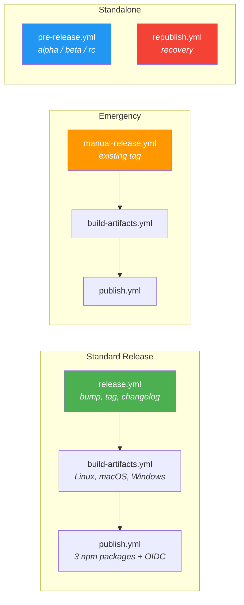
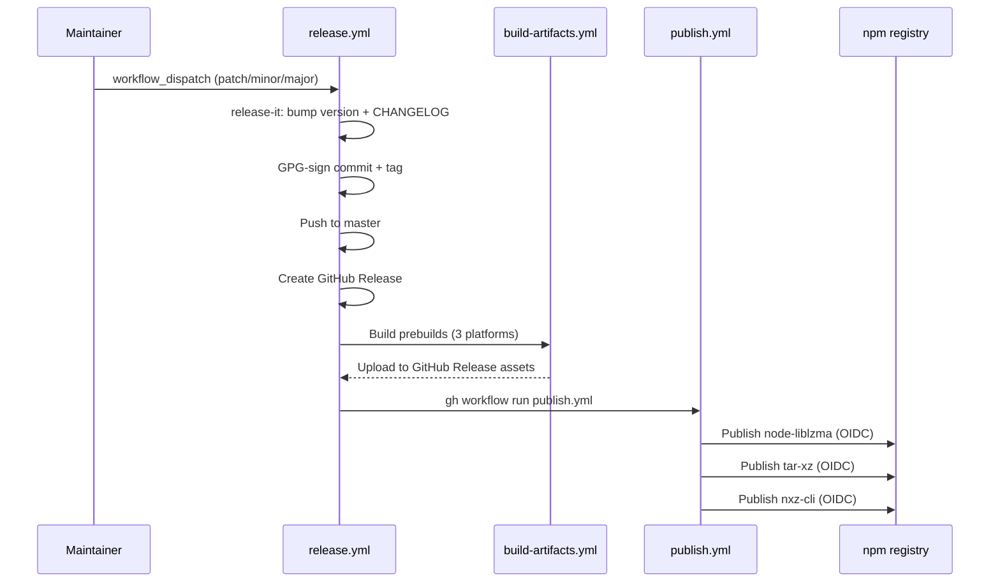

# Release Process

This document describes the complete release and delivery pipeline for node-liblzma.

## Overview



## Standard Release

**Workflow:** `release.yml` (manual trigger via GitHub Actions UI)

This is the primary release path. It handles everything end-to-end.



### Inputs

| Input | Type | Description |
|-------|------|-------------|
| `increment` | choice: patch / minor / major | Semver bump type |
| `skip_npm` | boolean | Skip npm publish (dry run) |

### Steps

1. **Bump version** — `release-it-preset` updates `package.json` and `CHANGELOG.md` from conventional commits
2. **GPG-sign commit** — Version bump committed with GPG signature (key: `B98806DCD4E29D4D`)
3. **Create tag** — GPG-signed tag `vX.Y.Z`
4. **Push** — Commit and tag pushed to `master`
5. **GitHub Release** — Created automatically with generated release notes
6. **Build prebuilds** — Cross-platform native binaries via `build-artifacts.yml`
7. **Publish to npm** — All 3 packages via `publish.yml` (OIDC provenance)

### How to run

1. Go to **Actions** → **Release** → **Run workflow**
2. Select the semver increment (patch / minor / major)
3. Optionally check "Skip npm publish" for a dry run
4. Click **Run workflow**

## Emergency Release

**Workflow:** `manual-release.yml` (manual trigger)

Use this when a tag already exists but the release pipeline failed partway through (e.g., GitHub Release wasn't created, prebuilds weren't built, or npm publish failed).

### When to use

- `release.yml` partially failed after creating the tag
- You created a tag manually and need to complete the release
- You need to re-run build + publish for an existing tag

### Inputs

| Input | Type | Description |
|-------|------|-------------|
| `tag` | string | Existing git tag (e.g., `v3.2.0`) |
| `skip_npm` | boolean | Skip npm publish |

### Steps

1. Checks out the given tag
2. Creates GitHub Release
3. Builds prebuilds for all platforms
4. Triggers `publish.yml`

## Pre-release

**Workflow:** `pre-release.yml` (manual trigger)

For publishing alpha, beta, or release candidate versions.

### Inputs

| Input | Type | Description |
|-------|------|-------------|
| `prerelease-type` | choice: alpha / beta / rc | npm dist-tag |
| `version` | string | Full version (e.g., `3.3.0-alpha.1`) |

### Steps

1. Runs tests and type-check
2. Builds native modules for Node 20, 22 × Linux, macOS, Windows
3. Publishes to npm with the appropriate dist-tag (`--tag alpha`)
4. Creates GitHub pre-release

### Installing a pre-release

```bash
npm install node-liblzma@alpha    # or @beta, @rc
```

## Recovery

**Workflow:** `republish.yml` (manual trigger)

Re-publishes an existing release to npm. For cases where npm publish failed but the GitHub Release and prebuilds are intact.

### Inputs

| Input | Type | Description |
|-------|------|-------------|
| `version` | string | Semver version (without `v` prefix) |
| `publish_npm` | boolean | Actually publish (safety gate) |
| `confirmation` | string | Must type "I understand the risks" |

### Notes

- Uses `NPM_TOKEN` secret (not OIDC) for authentication
- Downloads prebuilds from the existing GitHub Release
- Verifies prebuilds exist before publishing

## npm Packages

Three packages are published in dependency order:

| # | Package | npm name | Description |
|---|---------|----------|-------------|
| 1 | root | `node-liblzma` | Core XZ/LZMA2 bindings (native + WASM) |
| 2 | packages/tar-xz | `tar-xz` | tar.xz streaming library |
| 3 | packages/nxz | `nxz-cli` | CLI tool for XZ compression |

### Publishing details

- **Authentication:** OIDC trusted publishing (no npm token needed)
- **Node.js:** v24+ required in `publish.yml` (npm >= 11.5.1 for OIDC)
- **Provenance:** All packages published with `--provenance` attestation
- **Idempotent:** Already-published versions are skipped (safe re-runs)
- **Workspace protocol:** `pnpm pack` resolves `workspace:` dependencies before `npm publish`

## Supporting Workflows

| Workflow | Trigger | Purpose |
|----------|---------|---------|
| `ci.yml` | Push, PR, nightly | Tests, lint, coverage. Smart smoke/full matrix selection |
| `build-artifacts.yml` | Called by release/manual-release | Cross-platform prebuilds (Linux, macOS, Windows × x64) |
| `check-xz-updates.yml` | Weekly (Monday 3 AM UTC) | Monitors upstream XZ Utils, auto-PRs compatible updates |
| `docs.yml` | Release published, doc changes | Builds and deploys docs to GitHub Pages |
| `build-wasm.yml` | WASM file changes | Isolated WASM build with size gate (< 100KB gzipped) |

### check-xz-updates.yml

Runs weekly to detect new XZ Utils releases:
1. Queries GitHub API for latest XZ release
2. Compares with `xz-version.json`
3. If new version: runs full test suite against it
4. If tests pass: creates PR with auto-merge enabled
5. If tests fail: creates issue for manual review

## Secrets & Prerequisites

| Secret | Required | Used in | Purpose |
|--------|----------|---------|---------|
| `GPG_PRIVATE_KEY` | Yes | release, check-xz-updates | GPG-sign commits and tags |
| `GITHUB_TOKEN` | Auto | All workflows | GitHub API access |
| `CODECOV_TOKEN` | Yes | ci (coverage) | Upload coverage reports |
| `NPM_TOKEN` | Only republish | republish.yml | Manual npm auth (OIDC handles normal publishes) |

### OIDC Trusted Publishing

Normal releases use npm OIDC trusted publishing — no npm token is stored as a secret. This requires:
- `id-token: write` permission in the workflow
- `registry-url: 'https://registry.npmjs.org'` in setup-node
- Node.js 24+ (npm >= 11.5.1)
- Each package must be configured for trusted publishing on npmjs.com

### GPG Signing

All release commits and tags are signed with GPG key `B98806DCD4E29D4D`. The `crazy-max/ghaction-import-gpg` action configures git to use the key automatically. Committer identity: `Olivier ORABONA <oorabona@users.noreply.github.com>`.

## Troubleshooting

### OIDC publish fails

- Verify `id-token: write` permission is set
- Ensure Node.js version is 24+ (npm OIDC requires >= 11.5.1)
- Publish workflow must be triggered via `workflow_dispatch` (not `workflow_call`) — the OIDC token includes the workflow filename, and `workflow_call` makes the *caller* appear in the token instead

### Prebuilds missing from npm package

- Verify `prebuilds/` is listed in `package.json` `"files"` array
- Check that `build-artifacts.yml` completed successfully and uploaded assets to the GitHub Release
- Run `npm pack --dry-run | grep prebuilds` to verify tarball contents

### GITHUB_TOKEN doesn't trigger other workflows

Actions performed by `GITHUB_TOKEN` don't trigger other GitHub workflows. This is why:
- `release.yml` uses `gh workflow run` (creates a new workflow_dispatch event) instead of relying on release events
- `manual-release.yml` exists as a fallback for when automated chains break
